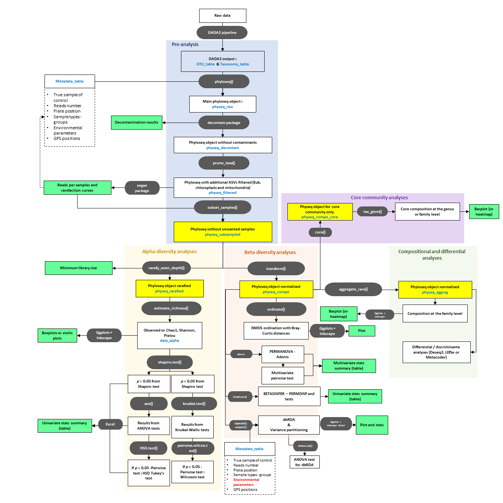

# Tutorial_16S_metabarcoding_analyses

## 1. Getting ready to start with R

### 1.1 Overall workflow


### 1.2 Package installation
First, some packages need to be installed.

For some of the packages, the installation needs to go through BiocManager
```
if (!requireNamespace("BiocManager", quietly = TRUE)) {install.packages("BiocManager")}
```

For the whole workflow, three main packages are necessary: [phyloseq](https://joey711.github.io/phyloseq/) , [microbiome](https://microbiome.github.io/tutorials/) and [vegan](https://www.rdocumentation.org/packages/vegan/versions/2.6-4)

```
BiocManager::install("phyloseq")
BiocManager::install("microbiome")
install.packages(“vegan”)
```

For the whole decontamination of the dataset: 
```
BiocManager::install("decontam") #for decontamination of the dataset
```

For discriminant analyses
```
BiocManager::install("microbiomeMarker")
BiocManager::install("DESeq2")
install.packages("metacoder")
```

For the graphical outputs
```
install.packages("ggplot2")
install.packages("randomcoloR")
install.packages("ggh4x")
install.packages("hrbrthemes")
install.packages("cowplot")
install.packages("RColorBrewer")
install.packages("ggpubr")
install.packages("ggrepel")
```

For data frame manipulations
```
install.packages("stringi")
install.packages("rlang")
install.packages(Rcpp)
install.packages(“dplyr”)
```

For additional statistical tests 
```
install.packages("agricolae")
install.packages(“RVAideMemoire”)
install.packages('devtools')
library(devtools)
install_github("pmartinezarbizu/pairwiseAdonis/pairwiseAdonis")
install.packages(“ape”)
```

### 1.3 Packages loading
Now, let's load all the packages we need for the moment
```
library(stringi)
library(vegan)
library(Rcpp)
library(ggplot2)
library(randomcoloR)
library(rlang)
library(phyloseq)
library(ape)
library(dplyr)
library(agricolae) 
library(RVAideMemoire) 
library(microbiome)
library(hrbrthemes)
library(cowplot) 
#library(ggthemes)
library(RColorBrewer) 
library(decontam)
library(ggrepel) 
library(rcompanion)
library(pairwiseAdonis) 
library(ggpubr)
library(ggh4x)
```

### 1.4 Setting and preparing your working directory
```
setwd("your_path_to_insert_here")
```
We will now make subfolders where all the output from our analysis will be saved
```
dir.create("1_Data_prep_results")
dir.create("2_Alpha_div_results")
dir.create("3_Beta_div_results")
dir.create("4_Compositional_results")
```


## 2. Preparation of the 16S metabarcoding dataset for a ready-to-go analysis

### 2.1. Import the dataset
First, we will import 3 ".csv" data tables 
- The "ASV_table" which includes all the numbers of reads of each ASVs in every samples
- The "Taxonomy_table" which includes all taxonomic information of each ASVs (usually levels such as Phylum, Class, Order, Family, Genus)
- The "Metadata_table" which includes all supplementary information on the sample (e.g. sampling date, location, etc)
The ".csv" files should be delimited with ;

```
ASV_table = read.csv(file = "ASV_table.csv" , header = TRUE , sep = ";" , row.names = 1)
dim(ASV_table)

TAX_table = read.csv(file = "Taxonomy_table.csv" , sep = ";" , header = T , row.names = 1)
TAX_table = as.data.frame(TAX_table)
dim(TAX_table)

META_table = read.csv(file = "Metadata_table.csv" , header = TRUE , sep = ";" , row.names = 1)
dim(META_table)
```

Using the dim() make sure that the dimension of each dataset is correct. 
- The number of rows should be the same for the ASV_table and Taxonomy_table
- The number of columns should be the same for the ASV_table and Metadata_table

Optional: if you have a tree file you can also import it for phyloseq

```
TREE_file = read_tree("Tree-file.nwk.nhx")
TREE_file
```

### 2.2. Create your main phyloseq object (output: physeq_raw)
Phyloseq is a package that allows you to generate a single object combining the ASV_table, the TAX_table, and the META_table (and optionally the TREE_file).

Using a phyloseq object makes your life more simple, as every manipulation of the dataset will be done on each tables. 

For example, removing a sample from the phyloseq object will remove it simulteanously from the ASV_table and META_table. Same idea for removing an ASV.
```
ASV_phylo = otu_table(ASV_table, taxa_are_rows = TRUE)
dim(ASV_phylo)

TAX_phylo = tax_table(TAX_table)
dim(TAX_phylo)

META_phylo = sample_data(META_table)
dim(META_phylo)

physeq_raw = phyloseq(ASV_phylo, TAX_phylo, META_phylo)
physeq_raw

```
Optional: your TREE_file can also be added in the phyloseq object
```
TREE_phylo = phy_tree(TREE_file)
physeq_raw_tree = merge_phyloseq(physeq_raw, random_tree)
physeq_raw_tree
```
Your raw phyloseq object is now ready. 

Try to have a closer look at what's inside! 
Check how many ASVs and samples you have in total


<details>
  <summary>See the answer</summary>
  
  ```
ntaxa(physeq_raw)
nsamples(physeq_raw)
  ```
We have XXX ASVs in total and XXX samples
</details>

Check how many ASVs per sample you have 


<details>
  <summary>See the answer</summary>
  
  ```
taxa_sums(physeq_raw)
min(taxa_sums(physeq_raw))
max(taxa_sums(physeq_raw))
mean(taxa_sums(physeq_raw))
  ```
We have around XXX ASVs on average. XX in max, and XX in min (probably an extraction blank or negative control) 
</details>

### 2.2. Decontaminate your dataset using the decontam package (output: physeq_decontam)
You will need first to create a data frame "Libsize_table" to inspect your library size
 ```
Libsize_table <- as.data.frame(sample_data(physeq_raw)) 
Libsize_table$LibrarySize <- sample_sums(physeq_raw)
Libsize_table <- Libsize_table[order(Libsize_table$LibrarySize),]
Libsize_table$Index <- seq(nrow(Libsize_table))
Libsize_table

plot_libsize = ggplot(data=Libsize_table, aes(x=Index, y=LibrarySize, color=Sample_or_Control))
plot_libsize = plot_libsize + geom_point()
plot_libsize

ggsave(filename = "Plot_libsize.pdf", 
       plot = plot_libsize, 
       device = "pdf" , 
       width = 15 , height = 10, units = "cm", 
       path = "./1_Data_prep_results")
 ```
Based on the figure, we can observe that the control samples (negative controls and extraction blanks) have a library size significantly lower compared to most of our true samples.

Let's now identify the contaminants using the prevalence method
 
 ```
sample_data(physeq_raw)$is.neg <- sample_data(physeq_raw)$Sample_or_Control == "Control"

contam_prev05 <- isContaminant(physeq_raw, method="prevalence", neg="is.neg", threshold=0.5)
contam_prev05 = cbind(as.data.frame(tax_table(physeq_raw)) , contam_prev05)
contam_prev05

 ```
Based on these results, how many contaminants were identified? Are they abundant in the dataset? 

<details>
  <summary>See the answer</summary>
  
  ```
table(contam_prev05$contaminant)
  ```
We have identified 23 ASVs as contaminants. 
  ```
subset(contam_prev05, contaminant == "TRUE")
  ```
Most of them have a low prevalence in our dataset (which is good)
</details>

Now, let's save this information in a csv file, if we need to go back later on these contamination results 
  ```
write.csv(contam_prev05, file.path("./1_Data_prep_results" , "Contamination_table_prev05.csv"))
  ```

We can now make a plot of the prevalence of the contaminants ASV in the controls and true samples

We have to make phyloseq object of presence-absence in negative controls and true samples ...
  ```
ps.pa <- transform_sample_counts(physeq_raw, function(abund) 1*(abund>0))
ps.pa.neg <- prune_samples(sample_data(ps.pa)$Sample_or_Control == "Control", ps.pa)
ps.pa.pos <- prune_samples(sample_data(ps.pa)$Sample_or_Control == "True sample", ps.pa)
 ```
... and then make a data.frame of prevalence in positive and negative samples
 ```
df.pa <- data.frame(pa.pos=taxa_sums(ps.pa.pos), pa.neg=taxa_sums(ps.pa.neg),
                    contaminant=contam_prev055$contaminant)
 ```
The prevalence can be plotted as follows
 ```
plot_prevalence = ggplot(data=df.pa, aes(x=pa.neg, y=pa.pos, color=contaminant)) 
plot_prevalence = plot_prevalence + geom_point() 
plot_prevalence = plot_prevalence + xlab("Prevalence (Negative Controls)") + ylab("Prevalence (True Samples)")
plot_prevalence
 ```
Conclusion: the contaminants are mostly prevalent in the negative controls and not in the true samples! The results are ok !

We can save this plot, as a figure to confirm the quality of our decontamination
 ```
ggsave(filename = "Plot_prevalence.pdf", 
       plot = plot_prevalence, 
       device = "pdf" , 
       width = 15 , height = 10, units = "cm", 
       path = "./1_Data_prep_results")
 ```

We can finally make our phyloseq object without these contaminants
 ```
physeq_decontam = prune_taxa(!contamdf.prev05$contaminant, physeq_raw)
physeq_decontam
 ```
Do you confirm that the good number of contaminating ASVs has been removed ? 
<details>
  <summary>See the answer</summary>
  
  ```
ntaxa(physeq_raw)
ntaxa(physeq_decontam)
  ```
yes, 23 ASVs were removed!
</details>


### 2.3. Filter additional non-prokaryotic taxa by removing ASVs with 16S from Eukaryotes, chloroplasts, and mitochondria

  ```
physeq_filtered = subset_taxa(physeq_decontam, 
                              (Kingdom != "Eukaryota" | is.na(Kingdom)) &
                              (Order!= "Bacteria | Cyanobacteria | Cyanobacteriia | Chloroplast"| is.na(Order)) &
                              (Family != "Bacteria | Proteobacteria | Alphaproteobacteria | Rickettsiales | Mitochondria"| is.na(Family)))

physeq_filtered
  ```
How many non-prokaryotic ASVs were filtered in total? 

<details>
  <summary>See the answer</summary>
  
  ```
ntaxa(physeq_decontam) - ntaxa(physeq_filtered)
  ```
1002 ASVs in total
</details>

### 2.4. Checking the rarefaction curves and removing samples with not enough reads 
Rarefactions curves are a good representation to verify if all the diversity is covered in each sample. 

On the x axis we have the number of reads, on the y axis, the number of new ASVs discovered. 

If we reach a plateau, it means that no more new ASVs are identified, even if we increase or sample size (number of reads).

  ```
as.data.frame(t(otu_table(physeq_filtered)))

rarecurve(as.data.frame(t(otu_table(physeq_filtered))), step = 20, cex = 0.5)
#save manually the plot to ./1. Data_prep results
  ```
Future update soon with the package [inext](https://johnsonhsieh.github.io/iNEXT/)

Based on these rarefaction curves we can now set a minimum reads threshold. 

The samples below this threshold will be excluded from our analysis, as the sequencing depth is expected to be not enough. 


  ```
min_reads_threshold = 2000
physeq_subsampled = prune_samples(sample_sums(physeq_filtered)>=10000, physeq_filtered)
physeq_subsampled
  ```
With this code, we also remove the negative controls and extraction blanks. 

How many samples were removed in total ? 
<details>
  <summary>See the answer</summary>
  
  ```
nsamples(physeq_filtered) - nsamples(physeq_subsampled)
  ```
xxx samples in total (including the negative controls and extractions blanks)

</details>

physeq_subsampled is your phyloseq object ready to be transformed for the alpha-diversity, beta-diversity and compositional analyses ! 
Save it as a RDS object to avoid all these steps in a future session! 

  ```
saveRDS(physeq_subsampled, "Physeq_subsampled.RDS")
  ```
When you start a new session (few days later for example), here is how to load the phyloseq object again

  ```
physeq_subsampled = readRDS("Physeq_subsampled.RDS")
physeq_subsampled
  ```

## 3. Before stating starting the analyses, let's see why the dataset should be transformed

Rarefying your datasets means that in every sample, you will randomly remove ASVs counts until they reach the same number of ASVs of the sample with the lower size. 

As a result, all your samples will have the same read numbers, which correspond to the minimum library size

Why do we remove such information in our dataset? To make diversity comparison possible between samples, as some samples end up with more reads than others after the sequencing. 

How does it impact my dataset? Rarefaction usually removes very rare ASVs from your datasets, as their is a high chance that their original counts (e.g. 1 or 2) goes to 0.

This approach is currently criticized and debated. Some groups argue that rare ASVs are essential to consider, while others find that the effect of the rarefaction is almost non-existent

For more details, see these papers:

McMurdie, P.J. and Holmes, S. (2014) Waste not, want not: why rarefying microbiome data is inadmissible. PLoS Comput Biol 10: e1003531.

Gloor, G.B., Macklaim, J.M., Pawlowsky-Glahn, V., and Egozcue, J.J. (2017) Microbiome datasets are compositional: and this is not optional. Front Microbiol 8: 2224.

Schloss, P.D. (2023) Waste not, want not: revisiting the analysis that called into question the practice of rarefaction. mSphere 9: e00355-23.
 

<details>
  <summary>See my opinion here on the quesion</summary>
  
I think that the choice of the rarefaction transformation depends on the look of the rarefaction curves.

If most of your samples almost reach the plateau, but not entirely, then the rarefaction is needed for the alpha-diversity analyses.

If all samples clearly showed a full plateau, it means that nothing is missing in your samples, and then nothing to worry about the difference in library size.

In this rare situation, there is no need to rarefy your dataset and the alpha-diversity (especially the richness) can be plotted with the real counts from your dataset, with all the rare ASVs.

For all the rest of the analyses (beta-diversity and composition), I prefer to keep all the information and just work with normalization to the sum (i.e. transforming your counts into percentages).

</details>


## 4. Alpha diversity analyses

### 4.1. Create a phyloseq rarefied objects specifically for alpha-div analyses

As explained just before, we will rarefy our dataset, so all samples will end up with the same number of reads in total.
  ```
min(sample_sums(physeq_subsampled))

physeq_rarefied = rarefy_even_depth(physeq_subsampled)
physeq_rarefied
  ```
How many ASVs per sample do we end up with? 

<details>
  <summary>See the answer</summary>
  
  ```
sample_sums(physeq_subsampled)
  ```
10073 ASVs per sample

</details>


### 4.2. Consider the factors of comparison for this analysis and prepare your color vectors

Before plotting the alpha diversity, let's go back to the current metadata

  ```
metadata_subsampled = sample_data(physeq_subsampled)
metadata_subsampled
  ```

What factor of interest is important to compare in this dataset? How many levels (groups) there is in these factors?
<details>
  <summary>See the answer</summary>

- For the temporal changes: the sampling date

```
factor(metadata_subsampled$Sampling_date)
```
We have 6 distinct sampling dates

- For the spatial comparison: the sampling site

```
factor(metadata_subsampeld$Sampling_site)
```
We have 5 distinct sampling sites

</details>

Let's create the color vector for the sampling dates. 

For temporal changes, I like to have my colors changing gradually from a cold color for the cold months, to hot colors for the warmer months

```
color_months = c("M1 February" = "Violet",
                 "M2 March" = "SkyBlue",
                 "M3 April" = "LightGreen",
                 "M4 May" = "Yellow",
                 "M5 June" = "Orange",
                 "M6 July" = "Red")
```

### 4.3. Create a data frame with the results of the alpha-diversity indices and the metadata

The function estimate_richness allow you to calculate many different alpha-diversity indices. 

Here we will keep only the observed richness, the Shannon index and the Chao1 (estimated richness)

```
data_alpha = estimate_richness(physeq_rarefied , measures = c("Observed", "Shannon", "Chao1"))
data_alpha
```

Unfortunately, phyloseq does not provide the Pielou index, so we have to add it to calculate it with this formula
```
Pielou = data_alpha$Shannon / log(data_alpha$Observed)
Pielou
```

We can now add the Pielou index and the factors of interest in the data frame
```
data_alpha_all = cbind(metadata_subsampled[, c("Sampling_site","Sampling_date")], data_alpha , Pielou)
data_alpha_all
```

What if I don't want to include all the samples in my analysis? (just only 3 of the 6 months for example)

<details>
  <summary>See the answer</summary>
To plot your alpha diversity results if you want to include just a specific selection of samples, use the subset function

```
data_alpha_all_subset = subset(data_alpha_all, Sample_type == "3. Cultivated sponges" | Sample_type == "2. Gemmules"  )
data_alpha_all_subset 
```

</details>

### 4.4. Generate a single figure for the 3 alpha-diversity indices together

To have the three diversity indices (Shannon, Chao1 and Pielou) in different facets, we need to re-arrange the data.frame with a single column for all values

```
data_alpha_bgs_long = melt(data_alpha_bgs, id.var=c("Region_site"))
colnames(data_alpha_bgs_long) <- c("Region_site", "Index", "Values")
data_alpha_bgs_long
```

We can now make boxplots using ggplot2 with facet_grid for the figure
```
plot_alpha_bgs = ggplot(data_alpha_bgs_long, aes(Region_site ,Values, fill = Region_site))
plot_alpha_bgs = plot_alpha_bgs + geom_boxplot(alpha = 0.8, size = 1) + facet_grid(  Index ~ ., scales="free") 
plot_alpha_bgs = plot_alpha_bgs + geom_point(size = 2, alpha = 0.8, pch = 21, stroke = 1)
plot_alpha_bgs = plot_alpha_bgs + theme_bw(base_size = 15) 
plot_alpha_bgs = plot_alpha_bgs + theme(legend.position="left")
plot_alpha_bgs = plot_alpha_bgs + theme(axis.title.x = element_blank(),axis.title.y = element_blank())
plot_alpha_bgs = plot_alpha_bgs + theme(axis.text.x = element_text(angle=45, vjust = 1, hjust = 1))
plot_alpha_bgs = plot_alpha_bgs + scale_fill_manual(values = colorpal_site)
plot_alpha_bgs

ggsave(filename = "Plot_alpha_Q1.pdf", 
       plot = plot_alpha_Q1, 
       device = "pdf" , 
       width = 15 , height = 25, units = "cm", 
       path = "./2_Alpha_div_results")
```


### 4.5. Test the normality of your distribution for each index


